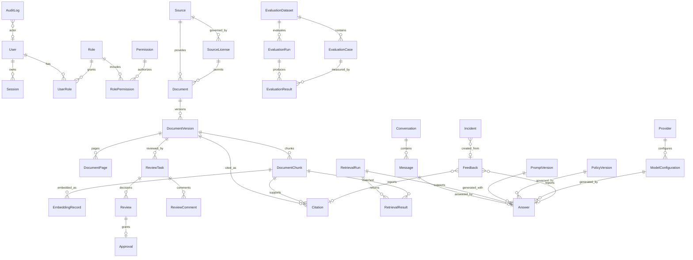

# Core Domain Database Schema Design

Status: design draft for `TASK-02-01`

This document is the human-readable companion to [`core-domain.schema.json`](core-domain.schema.json). It defines the relational schema that later migration tasks will turn into executable PostgreSQL migrations.

## Design Goals

- Cover every core entity listed in SRS §23.
- Keep source metadata, license metadata, document content, normalized chunks, embeddings, retrieval traces, citations, feedback, incidents, provider configuration, prompts, policies and evaluations in separate tables.
- Preserve referential integrity with explicit foreign keys and unique constraints.
- Support auditability through actor fields, timestamps, request/trace metadata and append-only records for sensitive workflows.
- Enforce production retrieval boundaries: only published document versions and published chunks with valid license/embedding permission may become active retrieval records.

## PostgreSQL Conventions

| Concern | Design |
|---|---|
| Primary keys | `uuid`, generated by `gen_random_uuid()` |
| Timestamps | `created_at`, `updated_at` as `timestamptz` |
| Soft delete | `deleted_at` for user-facing mutable records |
| Versioning | `row_version` for mutable records; immutable version tables for documents/prompts/policies/datasets |
| JSON payloads | `jsonb` for metadata, policies, metrics and structured results |
| Search | `tsvector` + GIN for full-text; pgvector HNSW/IVFFlat for embeddings in later migrations |
| Case-insensitive email | `citext` extension |
| Audit trace | `request_id` and `trace_id` where request correlation is required |

## Entity Groups

### Identity and RBAC

| Entity | Table | Key constraints | Notes |
|---|---|---|---|
| User | `auth_users` | unique active lower-case email | Password hash and profile fields are sensitive; soft delete/anonymization supported. |
| Role | `auth_roles` | unique active role name | System roles are protected by application policy. |
| Permission | `auth_permissions` | unique `(resource, action)` | Managed by migration or admin workflow. |
| Session | `auth_sessions` | unique session hash; FK to user | Stores hashes only, supports revocation and expiry. |
| UserRole | `auth_user_roles` | unique `(user_id, role_id)` | Records `granted_by` for audit. |
| RolePermission | `auth_role_permissions` | unique `(role_id, permission_id)` | RBAC boundary for protected endpoints. |

### Source and License Governance

| Entity | Table | Key constraints | Notes |
|---|---|---|---|
| Source | `sources` | unique active `(name, owner)` | Source metadata is separate from imported content. |
| SourceLicense | `source_licenses` | unique `(source_id, license_name, valid_from)` | Stores storage, embedding, commercial-use and redistribution permissions. |

License design follows `docs/05_data/license_policy.md`: `UNKNOWN`, `PROHIBITED` and `EXPIRED` fail closed for production use. License records remain separate from `documents` and `document_versions` so revocation can suspend content without rewriting source text.

### Documents, Versions, Pages, Chunks and Embeddings

| Entity | Table | Key constraints | Notes |
|---|---|---|---|
| Document | `documents` | unique active `(source_id, canonical_id)` | Metadata and current `published_version_id`; no full text. |
| DocumentVersion | `document_versions` | unique `(document_id, version_number)` and `(document_id, content_hash)` | Immutable source/extracted text snapshot. |
| DocumentPage | `document_pages` | unique `(document_version_id, page_number)` | Optional source page mapping. |
| DocumentChunk | `document_chunks` | unique `(document_version_id, chunk_index)` and `(document_version_id, content_hash)` | Stores chunk text and normalized chunk text. |
| EmbeddingRecord | `embedding_records` | unique `(chunk_id, model_configuration_id)` | Active embeddings must reference a published document version and published chunk. |

#### Content Boundary

- Original files live in private object storage and are referenced by `document_versions.original_file_key`.
- Extracted full text is scoped to immutable `document_versions`.
- Normalized searchable text is scoped to `document_chunks.content_normalized`.
- Embeddings are derived artifacts in `embedding_records` and must be invalidated/recreated when chunks, models or license policy change.

### Review and Approval

| Entity | Table | Key constraints | Notes |
|---|---|---|---|
| ReviewTask | `review_tasks` | one open task per document version and review level | Queue is indexed by status, level and due date. |
| Review | `reviews` | FK to task and reviewer | Append-only decision record. |
| Approval | `approvals` | unique `(document_version_id, approval_level)` | Captures required approval level and validity. |
| ReviewComment | `review_comments` | FK to task and author | Soft-deleted comments retain audit trail. |

Publishing is server-side validated: the document version must have the required approval level, valid license permission and no blocking review task.

### Retrieval, Citations and Answers

| Entity | Table | Key constraints | Notes |
|---|---|---|---|
| RetrievalRun | `retrieval_runs` | unique request ID | Records query, filters, retriever version and evidence sufficiency. |
| RetrievalResult | `retrieval_results` | unique `(retrieval_run_id, rank)` | Links run results to document version, chunk and optional citation. |
| Citation | `citations` | unique `(canonical_reference, document_version_id)` | Always links to source document version and chunk/reference. |
| Conversation | `conversations` | FK to user or guest session | Soft delete; conversation text is sensitive. |
| Message | `messages` | FK to conversation | Stores message hash for integrity; body is sensitive. |
| Answer | `answers` | unique message | Records model, prompt, policy, retrieval run, risk and evidence sufficiency. |

Production retrieval and citation correctness follow SRS requirements FR-RET-009 and FR-CIT-002: retrieval results and citations must always be traceable to an immutable document version and a chunk.

### Feedback, Incidents and Audit

| Entity | Table | Key constraints | Notes |
|---|---|---|---|
| Feedback | `feedback` | FK to optional user/answer/citation | Soft-deleted user feedback; body is sensitive. |
| Incident | `incidents` | FK to feedback and affected resource IDs | Tracks P0-P3 incident severity and remediation state. |
| AuditLog | `audit_logs` | indexed by resource, actor and trace | Append-only summaries; never stores plaintext secrets or full private conversations by default. |

### Providers, Models, Prompts and Policies

| Entity | Table | Key constraints | Notes |
|---|---|---|---|
| Provider | `providers` | unique active `(name, provider_type)` | Stores secret references, not plaintext secrets. |
| ModelConfiguration | `model_configurations` | unique active `(provider_id, model_name)` | Separates LLM, embedding, reranker and other model configs. |
| PromptVersion | `prompt_versions` | unique `(name, version)` | Immutable versioned prompts with hashes. |
| PolicyVersion | `policy_versions` | unique `(policy_name, version)` | Immutable deterministic policy version records. |

### Evaluation

| Entity | Table | Key constraints | Notes |
|---|---|---|---|
| EvaluationDataset | `evaluation_datasets` | unique `(name, version)` | Dataset manifest and license status. |
| EvaluationCase | `evaluation_cases` | unique `(dataset_id, case_key)` | Question, expected citations and risk metadata. |
| EvaluationRun | `evaluation_runs` | FK to dataset/model/prompt/policy | Immutable evaluation execution trace. |
| EvaluationResult | `evaluation_results` | unique `(evaluation_run_id, evaluation_case_id)` | Per-case metrics and failures. |

## ERD Overview

## Core Invariants

1. A `Document` in `published` status must have `published_version_id` set.
2. A published `DocumentVersion` must be frozen (`frozen_at IS NOT NULL`).
3. Production `RetrievalResult` rows must reference published document versions and published chunks.
4. Active `EmbeddingRecord` rows must reference a published document version, a published chunk and a model configuration.
5. `EmbeddingRecord.chunk_id` and `EmbeddingRecord.document_version_id` must agree on the same document version.
6. `Citation.chunk_id` and `Citation.document_version_id` must agree on the same document version.
7. `SourceLicense` controls storage, embedding and redistribution decisions; licenses are never merged into document content tables.
8. Provider rows store only `secret_ref`, not plaintext secret values.
9. Audit logs store summaries and trace metadata, not full secrets or chain-of-thought.
10. Prompts, policies, document versions and evaluation datasets are immutable versions.

## Index and Query-Plan Review

| Access pattern | Required indexes |
|---|---|
| Review queue | `idx_review_tasks_queue`, `idx_document_versions_document_status`, `idx_documents_review_status`, `idx_source_licenses_status` |
| Full-text retrieval | `idx_document_chunks_fts`, `idx_document_chunks_published_version`, `idx_document_versions_document_status`, `idx_source_licenses_status` |
| Vector retrieval | `idx_embedding_records_vector`, `idx_embedding_records_model_active`, `idx_document_chunks_published_version` |
| Citation lookup | `idx_citations_reference`, `idx_citations_chunk` |
| Conversation history | `idx_conversations_user_updated`, `idx_messages_conversation_created` |
| Audit review | `idx_audit_logs_resource`, `idx_audit_logs_actor`, `idx_audit_logs_trace` |
| Evaluation results | `idx_evaluation_runs_dataset_status`, `idx_evaluation_results_run_passed`, `idx_evaluation_cases_dataset` |

## Risks and Mitigations

| Risk | Mitigation |
|---|---|
| Private user questions in chat/retrieval traces | Mark fields sensitive, avoid full-body logs, soft delete/anonymize where policy permits. |
| License-restricted content entering production retrieval | Separate `source_licenses`; fail closed for unknown/prohibited/expired states; require valid license before publish/index. |
| Embeddings outliving suspended documents | Explicit embedding status and invalidation workflow tied to document/citation suspension. |
| Provider secret leakage | Store `secret_ref` only; audit provider/model changes. |
| Publishing without human review | Keep approvals separate and append-only; server-side transition validation and audit required. |
| Migration ordering and circular published version FK | Use deferrable FK or add `published_version_id` after `document_versions` is created in TASK-02-02. |

## Out of Scope for This Design Task

- Executable SQL migration files.
- ORM mappings and repository implementation.
- Actual seed data.
- Production backup policy.
- Runtime state-machine enforcement code.
