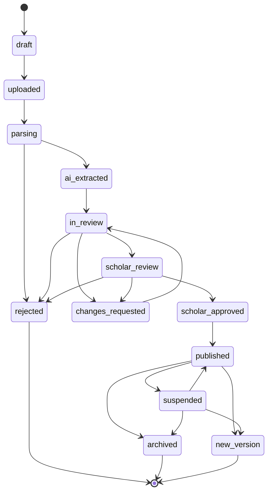
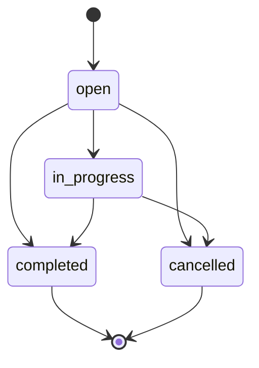
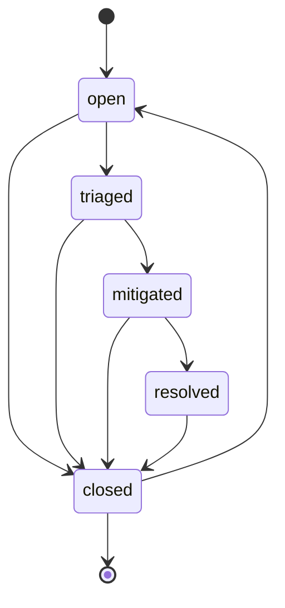

# State Machines

## Overview

Zayd implements explicit state machines to govern the lifecycle of documents, review tasks, and incidents. These state machines enforce valid transitions, require audit metadata, and fail closed on invalid operations.

## Purpose

State machines serve three critical functions:

1. **Data Integrity**: Prevent invalid status updates (e.g., draft documents becoming published without review)
2. **Audit Trail**: Require actor, timestamp, and reason for sensitive transitions
3. **Production Safety**: Only `PUBLISHED` documents with frozen versions are retrievable

## Enum Definitions

### DocumentStatus

Governs document lifecycle from upload through publication.

| Value | Description |
|---|---|
| `draft` | Initial state, document metadata created |
| `uploaded` | Original file uploaded to object storage |
| `parsing` | Document is being parsed and extracted |
| `ai_extracted` | Text and metadata extracted, ready for review |
| `in_review` | Under reviewer examination |
| `changes_requested` | Reviewer requested modifications |
| `rejected` | Document rejected, terminal state |
| `scholar_review` | Escalated to senior scholar review |
| `scholar_approved` | Scholar approved, ready for publication |
| `published` | Active in production retrieval |
| `suspended` | Temporarily removed from retrieval |
| `archived` | Permanently retired, terminal state |
| `new_version` | Superseded by newer version, terminal state |

### ReviewDecision

Actions available to reviewers.

| Value | Description |
|---|---|
| `approve` | Accept and advance document |
| `request_changes` | Request modifications before approval |
| `reject` | Decline document |
| `escalate` | Forward to senior reviewer |
| `mark_duplicate` | Flag as duplicate content |
| `mark_license_issue` | Flag licensing problem |

### PermissionState

License permission states for storage, embedding, and redistribution.

| Value | Description |
|---|---|
| `unknown` | Permission status not determined |
| `allowed` | Explicitly permitted |
| `prohibited` | Explicitly forbidden |
| `conditional` | Allowed under specific conditions |

### EvidenceStatus

Sufficiency of retrieved evidence for answer generation.

| Value | Description |
|---|---|
| `SUFFICIENT` | Adequate evidence to answer confidently |
| `PARTIALLY_SUFFICIENT` | Some evidence but gaps remain |
| `INSUFFICIENT` | Not enough evidence to answer |
| `CONFLICTING` | Evidence contains contradictions |

### RiskLevel

Content risk classification.

| Value | Description |
|---|---|
| `low` | General knowledge, low sensitivity |
| `medium` | Requires care, standard review |
| `high` | Sensitive ruling, requires scholar review |
| `restricted` | Highly sensitive, special handling |

### IncidentSeverity

Incident priority levels.

| Value | Description |
|---|---|
| `p0` | Critical: Production impact, immediate action |
| `p1` | High: Significant issue, urgent fix |
| `p2` | Medium: Important but not urgent |
| `p3` | Low: Minor issue, routine fix |

### IncidentStatus

Incident lifecycle states.

| Value | Description |
|---|---|
| `open` | Newly reported, needs triage |
| `triaged` | Assessed and assigned |
| `mitigated` | Immediate fix applied, monitoring |
| `resolved` | Root cause fixed, awaiting verification |
| `closed` | Verified complete, may reopen if recurs |

### ReviewTaskStatus

Review task lifecycle.

| Value | Description |
|---|---|
| `open` | Awaiting assignment |
| `in_progress` | Reviewer actively working |
| `completed` | Review decision submitted, terminal |
| `cancelled` | Task cancelled (e.g., document rejected), terminal |

### ProviderStatus

LLM/embedding/reranker provider availability.

| Value | Description |
|---|---|
| `enabled` | Active and available |
| `disabled` | Administratively disabled |
| `degraded` | Operational but experiencing issues |

## Document State Machine

### State Transition Diagram



### Allowed Transitions

| From State | To State(s) |
|---|---|
| draft | uploaded |
| uploaded | parsing |
| parsing | ai_extracted, rejected |
| ai_extracted | in_review |
| in_review | changes_requested, rejected, scholar_review |
| changes_requested | in_review |
| scholar_review | changes_requested, rejected, scholar_approved |
| scholar_approved | published |
| published | suspended, archived, new_version |
| suspended | published, archived, new_version |
| rejected | *(terminal)* |
| archived | *(terminal)* |
| new_version | *(terminal)* |

### Critical Invariants

1. **Production Retrieval**: Only `published` status with `frozen_at IS NOT NULL` is retrievable
2. **Reason Required**: Transitions to `published`, `suspended`, or `rejected` require non-empty `reason` in metadata
3. **Version Immutability**: Published document versions cannot be modified, only new versions created
4. **Audit Requirement**: Every transition records `actor_id`, `timestamp`, and optional `reason`/`notes`

## Review Task State Machine



| From State | To State(s) |
|---|---|
| open | in_progress, completed, cancelled |
| in_progress | completed, cancelled |
| completed | *(terminal)* |
| cancelled | *(terminal)* |

## Incident State Machine



| From State | To State(s) |
|---|---|
| open | triaged, closed |
| triaged | mitigated, closed |
| mitigated | resolved, closed |
| resolved | closed |
| closed | open *(reopen)* |

## Error Codes

State transition errors use stable error codes for client handling:

| Error Code | Exception | Description |
|---|---|---|
| `DOCUMENT_INVALID_TRANSITION` | `InvalidStateTransitionError` | Document transition not allowed |
| `REVIEW_TASK_INVALID_TRANSITION` | `InvalidStateTransitionError` | Review task transition not allowed |
| `INCIDENT_INVALID_TRANSITION` | `InvalidStateTransitionError` | Incident transition not allowed |
| `MISSING_TRANSITION_METADATA` | `MissingTransitionMetadataError` | Required metadata missing or invalid |
| `CONCURRENCY_CONFLICT` | `ConcurrencyConflictError` | Row version mismatch (optimistic lock) |

## Usage Examples

### Python

```python
from datetime import UTC, datetime
from zayd_common import (
    DocumentStatus,
    DocumentStateMachine,
    TransitionMetadata,
    InvalidStateTransitionError,
)

# Check if transition is allowed
can_publish = DocumentStateMachine.can_transition(
    DocumentStatus.SCHOLAR_APPROVED,
    DocumentStatus.PUBLISHED
)  # True

# Validate and record transition
metadata = TransitionMetadata(
    actor_id="user-uuid",
    timestamp=datetime.now(UTC),
    reason="Approved by Scholar Ahmad",
    notes="Verified hadith authenticity"
)

try:
    DocumentStateMachine.validate_transition(
        DocumentStatus.SCHOLAR_APPROVED,
        DocumentStatus.PUBLISHED,
        metadata
    )
    # Proceed with database update
except InvalidStateTransitionError as e:
    print(f"Transition blocked: {e.error_code}")
```

### TypeScript

```typescript
import {
  DocumentStatus,
  documentStateMachine,
  InvalidStateTransitionError,
  type TransitionMetadata,
} from "@zayd/contracts";

// Check if transition is allowed
const canPublish = documentStateMachine.canTransition(
  DocumentStatus.SCHOLAR_APPROVED,
  DocumentStatus.PUBLISHED
); // true

// Validate transition
const metadata: TransitionMetadata = {
  actorId: "user-uuid",
  timestamp: new Date(),
  reason: "Approved by Scholar Ahmad",
  notes: "Verified hadith authenticity"
};

try {
  documentStateMachine.validateTransition(
    DocumentStatus.SCHOLAR_APPROVED,
    DocumentStatus.PUBLISHED,
    metadata
  );
  // Proceed with API call
} catch (error) {
  if (error instanceof InvalidStateTransitionError) {
    console.error(`Transition blocked: ${error.errorCode}`);
  }
}
```

## Concurrency Handling

State transitions use optimistic locking via `row_version` to prevent conflicting updates.

### Pattern

```python
def transition_document_status(
    document_id: uuid.UUID,
    to_status: DocumentStatus,
    metadata: TransitionMetadata,
    expected_row_version: int
) -> None:
    # 1. Read current state
    current = db.query(Document).filter(Document.id == document_id).first()
    
    # 2. Validate transition
    DocumentStateMachine.validate_transition(
        from_state=current.review_status,
        to_state=to_status,
        metadata=metadata
    )
    
    # 3. Update with row_version check
    result = db.execute(
        update(Document)
        .where(Document.id == document_id)
        .where(Document.row_version == expected_row_version)
        .values(
            review_status=to_status,
            row_version=expected_row_version + 1,
            updated_at=metadata.timestamp
        )
    )
    
    if result.rowcount == 0:
        raise ConcurrencyConflictError(
            "Document was modified by another transaction"
        )
    
    # 4. Log to audit_logs
    audit_log(
        action="document.status.transition",
        resource_id=document_id,
        actor_user_id=metadata.actor_id,
        before={"status": current.review_status, "version": expected_row_version},
        after={"status": to_status, "version": expected_row_version + 1}
    )
```

### Key Points

- Read `row_version` before attempting transition
- Include `row_version` in UPDATE WHERE clause
- Increment `row_version` on successful update
- If `rowcount == 0`, another transaction won the race
- Retry with fresh read or surface conflict to user

## Implementation Files

### Python

- **Enums**: `services/common/src/zayd_common/enums.py`
- **State Machines**: `services/common/src/zayd_common/state_machines.py`
- **Exceptions**: `services/common/src/zayd_common/exceptions.py`
- **Retrievability**: `services/common/src/zayd_common/retrievability.py`

### TypeScript

- **Enums**: `packages/contracts/src/enums.ts`
- **State Machines**: `packages/contracts/src/state-machines.ts`
- **Retrievability**: `packages/contracts/src/retrievability.ts`

## Testing

### Test Coverage

- Valid and invalid transitions for all state machines
- Metadata validation (missing actor, timestamp, reason)
- Terminal state detection
- Concurrency conflict simulation
- Retrievability rules

### Running Tests

```bash
# Python
uv run pytest services/common/tests/test_state_machines.py
uv run pytest services/common/tests/test_state_machines_concurrency.py

# TypeScript
cd packages/contracts && pnpm test
```
